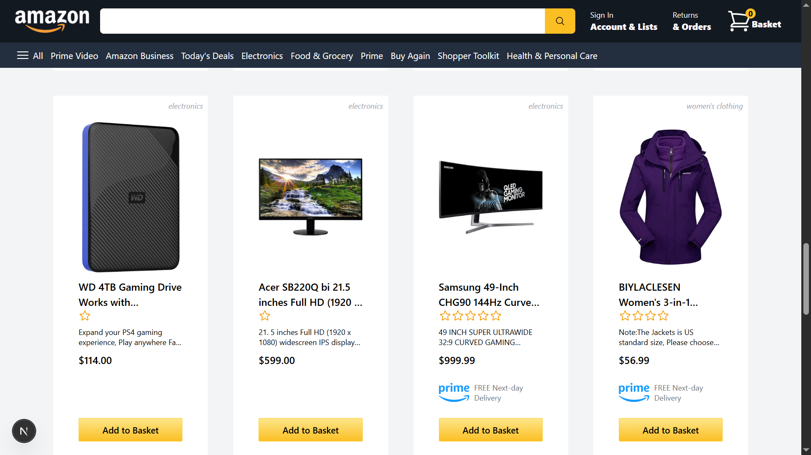
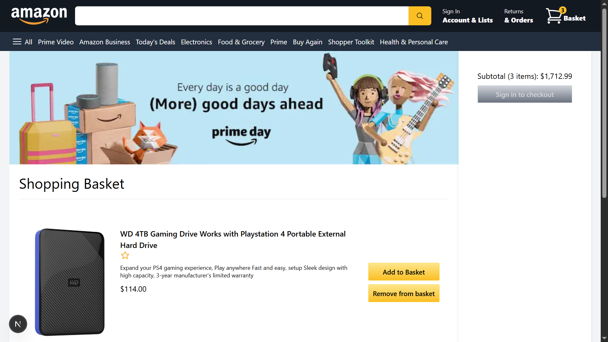

# 🛒 Amazon Clone

A fully functional Amazon Clone built using **React**, **Redux Toolkit**, **Firebase**, and **Tailwind CSS**. This project replicates key features of the Amazon e-commerce experience, including product listings, cart functionality, authentication, and checkout UI with fully responsive.

---

## 🔗 Live Demo

👉 [Click here to view the live site](https://e-commerce-app-ten-rouge.vercel.app/)

## 🎥 Demo Video

📽️ [Watch demo](https://drive.google.com/file/d/13ep9PXq1Z5PO9D81BPqxhy8e8oMEjAIZ/view)

## 📸 Screenshots

### 🛍️ Product feed Page

### 🛒 Checkout Page

---

## 🚀 Features

- ✅ Product listings with title, price, rating, and image
- ✅ Add to Cart / Remove from Cart functionality
- ✅ Shopping cart with total price
- ✅ Firebase Authentication (Email)
- ✅ Protected routes for checkout
- ✅ Mobile Responsive Design
- ✅ Currency formatting using `react-currency-formatter`

---

## 🛠️ Tech Stack

| Technology     | Use Case                       |
|----------------|--------------------------------|
| React          | UI Components and App Logic    |
| Redux Toolkit  | Global State Management        |
| Firebase       | Auth & Deployment              |
| Tailwind CSS   | Styling                        |
| Next.js        | Server-side rendering|
| Vercel         | Deployment                     |

---

## ⚠️ Disclaimer

> **This project is a personal educational clone of the Amazon website.**  
> It was built solely for learning purposes using **React**, **Redux Toolkit**, **Tailwind CSS**, **Next.js**, and **Firebase**.  
> This project is **not affiliated with, endorsed by, or connected to Amazon.com** in any way.

